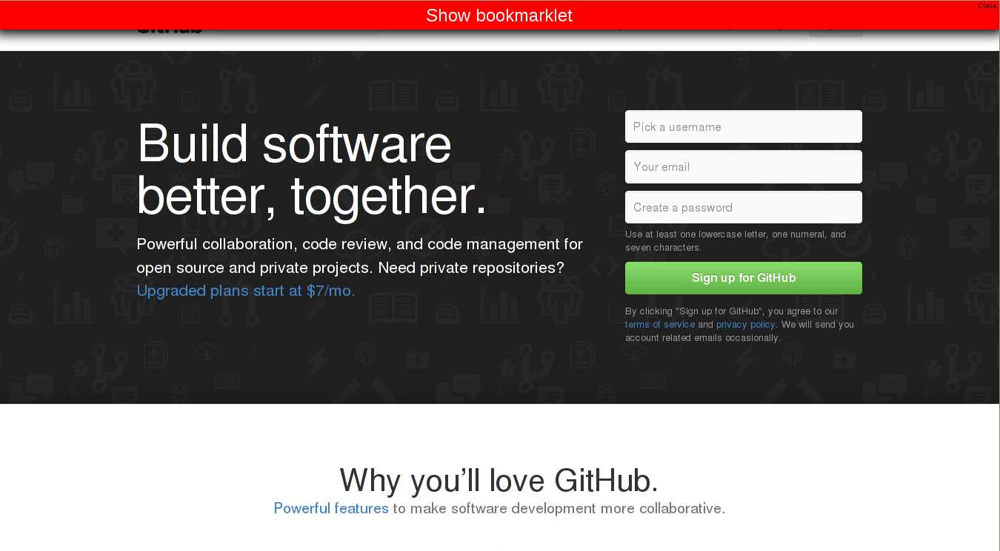
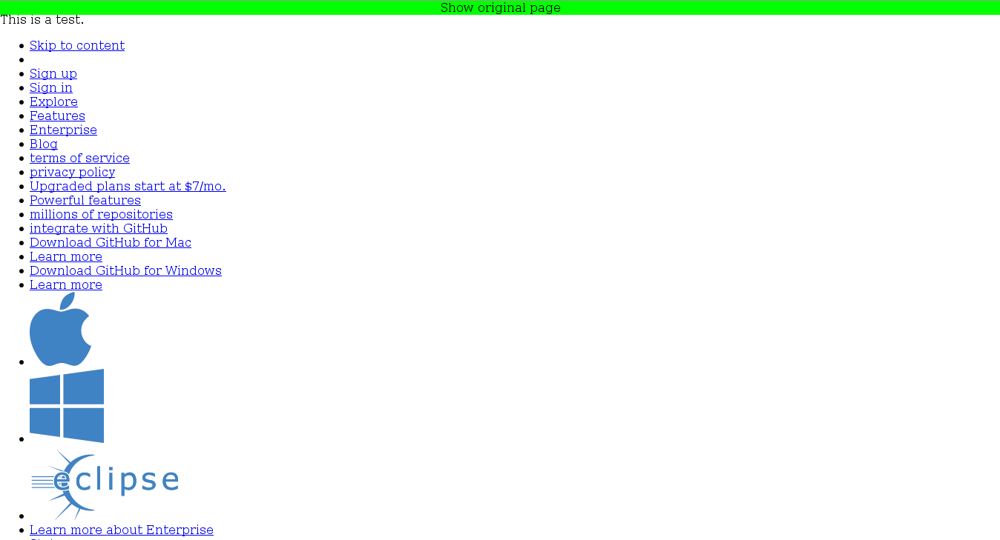

# Link Extractor Bookmarklet

This code can be used as bookmarlet to extract all the links of a page and
display them on the same page.

## Usage

*1.* Run the code in `bookmarklet.js` (paste to JS console or make a
   bookmarklet)

*2.* There is now a red bar at the top of the page, Click it.

*3.* There is now a green bar at the top of the page to let you know that
the bookmarklet is active. The original page is hidden. Instead, there is
now a list of all links on the page (all clickable). Image links are
displayed as the original clickable images.

*4.* Click the green bar on the top. The original page is now visible
again. There is also the red bar at the top. The list of links is gone.

*5.* Click the close button on the right of the red bar ("Close"). The red
bar is now gone. The original page is restored.
   
*6.* If there are glitches, just reload the page and everything should be
back to normal.

# Disclaimer

This does not work on all sites. Especially highly dynamic content may
cause problems. Also, the bookmarklet CSS/JS may interfere with the
original page or the other way around. Also, it may not catch all the links
on the page.
